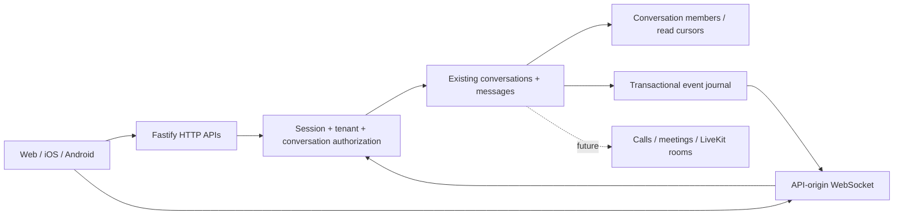

# Communications foundation

## Repository audit and implementation plan

Audited the default branch before implementation: pnpm 11 monorepo, Node 22–24,
Vite 7 / React 19 web app, Fastify 5 API, Zod 3 contracts, Drizzle 0.45 / PostgreSQL,
Supabase Auth. `users.id` is a tenant membership, not the Supabase identity.
`tenants` is the workspace boundary; staff operations live in the team modules.
Customer identities and tenant links already exist in `customer_accounts` and
`customer_client_links`. Owners/staff and capability checks protect existing APIs;
agency support sessions are a distinct access mechanism.

The existing omnichannel inbox already owns `conversations`, `conversation_messages`,
attachments, email/SMS/social delivery, and operational unread counters. Its broad
owner/operations access is unsuitable for private native conversations. There is no
existing API WebSocket or Redis service; the inbox polls HTTP every ten seconds.
Private uploads use Supabase Storage; email/SMS queues and worker cycles provide
notifications. Security auditing uses `account_access_audit_events` and agency
`platform_audit_events`. No new storage, notification delivery or audit system is needed.

Production runs the API on the VPS through systemd and the web/proxy on Cloudflare.
GitHub CI uses a PostgreSQL 17 service container. Migrations use the explicit database
manifest and `scripts/database/migrate.mjs`, not automatic Drizzle schema push.
Environment variables are validated in the existing API config. API tests use Node's
test runner, Sinon and Fastify injection; web tests use Vitest. Existing lint scripts
are placeholders that print success, rather than static analysis.

Plan implemented: extend the existing entities; distinguish their access policies;
add membership and read cursors; centralize native authorization; implement versioned
HTTP APIs and durable, authorized WebSocket event delivery; verify using actual
PostgreSQL SQL in an isolated PGlite engine, plus the repository checks.

## Architecture and database



One conversation domain supports `CHANNEL`, `PRIVATE_CHANNEL`, `DIRECT`,
`GROUP_DIRECT`, `PROJECT`, and `CLIENT`. The type labels describe intended use;
even CHANNEL requires explicit membership in Phase 1. No automatic public discovery
or joining is enabled. Existing rows retain `access_mode=INBOX`; new native rows use
`MEMBERS` and `primary_channel=NATIVE`. Both internal and future client channels use
the same native service. Existing customer-provider conversations retain their
delivery semantics; there is no automatic conversion or backfill of their members.

Conversations gain type, name, slug, description, creator and archive timestamp.
Messages gain type, update/edit/delete timestamps and a bigint native position.
Positions are strings on the wire to avoid JavaScript integer precision loss.
Existing message rows are not assigned native positions. Root messages and replies
use the existing `reply_to_message_id`; nested replies must target the root. Queries
return root reply counts and tombstones with a null body when deleted. No edit,
delete or archive endpoint is exposed yet.

New tables:

- `conversation_members`: one participant per conversation, OWNER/ADMIN/MEMBER/
  EXTERNAL/GUEST role, join/leave times, notification preference and monotonic read
  position. A principal is either a tenant `users` membership or an existing
  `customer_client_links` row, enforced with an exclusive-or constraint.
- `communication_events`: durable, ordered invalidations committed with the mutation.
- `communication_tickets`: hashed, single-use subscription capabilities expiring in
  30 seconds, bound to one conversation and the authenticated session.

Indexes cover tenant/conversation identity, unique tenant slug, active native
conversation listing, active memberships by tenant/principal, message position,
thread position, event replay, and ticket expiry. Composite foreign keys and scope
triggers reject cross-tenant members, messages and thread parents. These additional
SQL constraints live in the reviewed migration, following existing repository practice.

All mutations serialize on the conversation row so positions have commit order
within a conversation. Read cursors only advance to a real message in that
conversation. Unread totals count messages beyond the cursor (excluding own/deleted
messages) using its index; no user/message receipt matrix is created. Conversation
listing is UUID keyset paginated; message pages are newest first by native position.

## Authorization

`CommunicationsAuthorization` centralizes view/post/manage/invite/remove and message
checks. Identity, active tenant membership, active workspace, selected session,
security version, token expiry, session revocation and session invalidation time
are rechecked in the database. Workspace owners have no native membership bypass.
Agency support sessions cannot access native communications.

Only conversation OWNER/ADMIN can add or remove participants. Only OWNER can appoint
or remove ADMIN; OWNER cannot be removed through this API. DIRECT has exactly two
fixed participants. GROUP_DIRECT starts with at least three. External/guest roles
do not automatically grant membership elsewhere. Rejoining restores conversation
history and retains the previous read cursor; invitation therefore grants the
entire history, not just messages sent after joining.

Phase 1 admission accepts active tenant users only. The schema supports future
client participants through existing tenant-verified customer links; a later
customer-context actor resolver and invitation flow must explicitly authorize them.
It must never reinterpret an arbitrary customer ID as a tenant user or bypass the
conversation membership check. No external user receives access in this phase.

Native inputs are strict Zod objects; tenant, creator and sender come from the
verified context. Unknown/private/cross-tenant conversations return the same 404.
Legacy inbox lookup/list/update/send and ingest paths explicitly restrict to INBOX;
Customer 360 also excludes native conversations. Browser database roles have no
table/sequence access; new tables have RLS enabled. Only server-mediated access is
supported. Audit records contain identifiers and actions, never message text/tokens.

## API contract

Base: `/api/v1/communications/conversations`. HTTP calls use the existing bearer
token and tenant application context. Successful objects use `{ data }`; pages use
`{ data, nextCursor }`. Shared request, response and event schemas are exported by
`@ks-os/contracts` from `native-communications.ts`.

| Method/path | Behavior |
| --- | --- |
| GET `/` | Active member conversations; `after` UUID and `limit` 1–100 |
| POST `/` | Create with type/name, optional slug/description/memberUserIds |
| GET `/:conversationId` | Conversation, membership cursor and unread total |
| POST `/:conversationId/members` | Add tenant user with controlled role |
| DELETE `/:conversationId/members/:userId` | Revoke membership |
| GET `/:conversationId/messages` | `before` position, optional parentMessageId, limit 1–100 |
| POST `/:conversationId/messages` | Body up to 16,000 characters; optional thread root |
| POST `/:conversationId/read` | Advance to messageId; older updates do not regress |
| POST `/:conversationId/realtime-ticket` | Single-use 30-second ticket; no-store response |
| GET `/:conversationId/events?ticket=…&after=…` | WebSocket upgrade and authorized replay |

## Realtime contract

Runtime dependency: pinned `@fastify/websocket` (Fastify 5). Clients obtain a ticket
over authenticated HTTP and connect using **the API origin's wss endpoint**. Browser
clients need no custom WebSocket headers. Never log or persist ticket URLs. API logs
already redact request URLs. Any upstream access logger must redact query strings.

One socket subscribes to one authorized conversation. The upgrade consumes the
ticket and rechecks permissions. Each subsequent bounded event batch rechecks the
session, tenant and membership; removal/revocation closes the socket on its next
poll (normally within one second). No body is published into a global room.
Heartbeat pings detect dead peers; bounded batches and a buffered-byte ceiling close
slow clients. Clients write only through HTTP. API restart closes connections;
clients obtain another ticket and replay after their last processed event ID.

Events are version 1 with `id`, `tenantId`, `conversationId`, `type`, `occurredAt`,
and `resourceId`. Implemented: `conversation.created`, `message.created`,
`conversation.member_joined`, `conversation.member_left`, `conversation.read`.
They invalidate client caches; authorized HTTP fetches obtain content. Consumers
must deduplicate IDs and refetch current state on reconnect. Journal polling works
across API processes without Redis or session affinity. Journal retention is
currently unpruned; define a replay/reset contract before introducing retention.
Typing/presence and other ephemeral events belong to later phases.

The current Cloudflare web proxy reconstructs responses and does **not** preserve
WebSocket upgrades. This phase does not change that proxy. Use the existing API
hostname directly for wss and ensure its reverse proxy permits Upgrade. Same-origin
web-proxy WebSockets require a separate reviewed Cloudflare change before Phase 2.

## Migration and safe deployment

Migration: `20260929120000_communications_foundation.sql`, manifest order 88.
Additive, non-destructive: creates three tables and one explicit message sequence;
adds columns/indexes/triggers; widens the two existing transport checks to NATIVE.
No production data deletion or conversion. Index creation and ALTER TABLE can take
locks: rehearse against a staging copy and use a maintenance window if necessary.
The automated test applies both the original inbox migration and this migration
and verifies preservation of an existing inbox row.

Deployment classification: **VPS ONLY** for this API foundation, with the database
migration. No new environment variables, Redis, media server or storage bucket.
No deployment, production migration, Cloudflare operation or VPS modification is
performed by this change. The repository automatically deploys successful main CI,
so merging this review branch requires explicit operational approval.

**Merge gate:** the current automatic main deployment uses `APPLY_MIGRATIONS=0`
and targets both VPS and Cloudflare. Coordinate a hold on that automatic deployment
before merging this migration-bearing change. Use a reviewed VPS-only deployment
with migrations enabled, then restore normal automation after verification. This
PR does not alter deployment workflows or environment protections.

Before deployment: take/verify a backup, confirm a clean VPS checkout, review ALL
pending entries with `pnpm db:migrations:plan`, and rehearse the migration. After
review and merge, the intended operator procedure is:

```sh
cd /srv/ks-os
git status --short
DEPLOY_BRANCH=main pnpm deploy:vps:dry-run
DEPLOY_BRANCH=main APPLY_MIGRATIONS=1 bash scripts/deploy/deploy-vps.sh
sudo systemctl status ks-os-api --no-pager
curl -fsS http://127.0.0.1:5000/health
```

Do not use APPLY_MIGRATIONS=0 for the first deployment: new code queries new columns.
The migration runner applies every pending migration, so the plan must be reviewed
as a whole. There is no automatic database down-migration. The older API can run
against the additive schema, but native conversations must not be enabled until
the new inbox isolation filters are running; do not roll back to an older API once
private native conversations exist, because that API lacks those filters.

## Tests and Phase 2

`apps/api/tests/communications-foundation.test.ts` uses the real migration and SQL
in PGlite (PostgreSQL compiled to WebAssembly, test-only dependency), with Fastify
HTTP and WebSocket injection. It covers authentication, tenant/private isolation,
input spoofing, posting, message retrieval/pagination, threading, monotonic read
state, membership administration, database scope constraints, RLS privileges,
authorized replay, denied subscriptions, ticket replay and session revocation.
This is isolated test data; no production database connection is used.

Phase 2 can build channel/DM lists, message/thread views, unread indicators and
reconnect logic on these contracts. Calls/meetings should reference tenant and
conversation plus participants/initiator, then obtain LiveKit room credentials
only after this same authorization. Files/tasks/AI summaries can attach to the
canonical conversation/message identifiers. No LiveKit, calls, push delivery,
client UI, polished chat UI, or mobile apps are included here.

## Important files

- `apps/api/src/modules/communications/communications.authorization.ts`: central session and membership checks.
- `apps/api/src/modules/communications/communications.service.ts`: transactional domain operations, audit, replay and tickets.
- `apps/api/src/modules/communications/communications.database.ts`: shared SQL boundary.
- `apps/api/src/modules/communications/communications.routes.ts`: HTTP and WebSocket adapters.
- `apps/api/src/app.ts`, `apps/api/package.json`, `pnpm-lock.yaml`: registration and pinned dependencies.
- `packages/contracts/src/native-communications.ts`, `packages/contracts/src/index.ts`: client contracts and exports.
- `packages/database/src/conversation-schema.ts`, `packages/database/src/manifest.ts`, and the migration above: entities and migration registration.
- `apps/api/src/modules/conversations/conversation.service.ts`, `conversation-ingest.service.ts`, and `apps/api/src/modules/customer-360/customer-360.adapters.ts`: protect native records from inbox access paths.
- `apps/api/tests/communications-foundation.test.ts`: executable database/HTTP/WebSocket security regressions.

Implementation references: [Fastify WebSocket lifecycle](https://github.com/fastify/fastify-websocket)
and [Supabase row-level security](https://supabase.com/docs/guides/database/postgres/row-level-security).

## Verification record

Local production build, full typecheck, repository lint, UX copy audit, migration
manifest validation and diff whitespace check passed. All 70 web test files passed
(286 tests). The new PostgreSQL-backed communications suite passed all 15 subtests
(16 including the enclosing test), including numeric replay ordering past event ID 9.
All non-API workspace suites passed. The full API suite also includes legacy tests
that require a listening PostgreSQL server (readiness and business-profile migration);
this Windows checkout has none. GitHub CI supplies PostgreSQL 17 and is the required
final full-suite gate. Consult the PR checks for the result; no production environment
was used for local verification.
