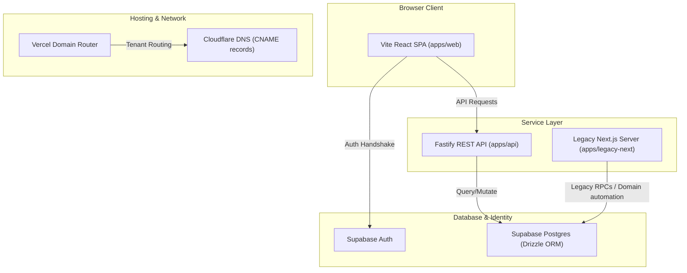

# Target Architecture Specification

This document details the target architecture for the production-grade multi-tenant platform.

## 1. Core Stack

- **Monorepo Manager**: `pnpm` Workspaces
- **Frontend Client**: React 19 + TypeScript + Vite + React Router 7 (Single Page Application)
- **Backend API**: Node.js + Fastify (Modular Controller Structure)
- **Database Engine**: Supabase PostgreSQL (hosted)
- **ORM / Migrations**: Drizzle ORM
- **Identity Provider**: Supabase Auth (JWT validation)
- **Validation**: Zod (shared data contracts)

---

## 2. Infrastructure Flow Diagram



---

## 3. Monorepo Package Breakdown

```
KS-OS-Platform/
├── apps/
│   ├── api/                          # Fastify API Server
│   │   ├── src/
│   │   │   ├── plugins/              # Auth guards, database clients, CORS
│   │   │   ├── routes/               # API endpoints (Bookings, CRM, POS, Waitlist)
│   │   │   └── server.ts             # App bootstrap
│   │   └── package.json
│   ├── web/                          # React Vite Frontend Client
│   │   ├── src/
│   │   │   ├── components/           # Redesigned components
│   │   │   ├── routes/               # React Router configurations
│   │   │   └── main.tsx
│   │   └── package.json
│   └── legacy-next/                  # Kept operational for domain provisioning
│       └── package.json
├── packages/
│   ├── database/                     # Shared database connection & Drizzle client
│   │   ├── src/
│   │   │   └── db.ts
│   │   ├── schema.ts                 # Appended schema mappings
│   │   └── package.json
│   ├── contracts/                    # Shared Zod validation schemas
│   │   ├── src/
│   │   │   └── index.ts
│   │   └── package.json
│   ├── auth/                         # JWT validation and permission checkers
│   │   ├── src/
│   │   │   └── index.ts
│   │   └── package.json
│   ├── ui/                           # Shared component styles
│   │   └── package.json
│   └── config/                       # TSConfig, ESLint configs
│       └── package.json
├── package.json                      # Monorepo workspaces configuration
└── pnpm-workspace.yaml
```

---

## 4. Multi-Tenant Separation Strategy

### Database Isolation
All tables reference a `tenant_id` field. Every API request must carry a verified Supabase Auth JWT token containing `app_metadata.tenant_id`. Fastify route hooks automatically extract and validate this claim to restrict queries:
```typescript
const tenantId = request.user.appMetadata.tenant_id;
const data = await db.select().from(appointments).where(eq(appointments.tenantId, tenantId));
```

### Subdomain Context
The Vite SPA reads the current window location to extract subdomains (e.g. `sovereign.kasimshah.com`). If a custom domain is configured (e.g. `sovereigngents.co.uk`), it queries the platform status API `/api/v1/service/status` using the domain hostname to resolve the matching `tenant_id` and design styling overrides.
